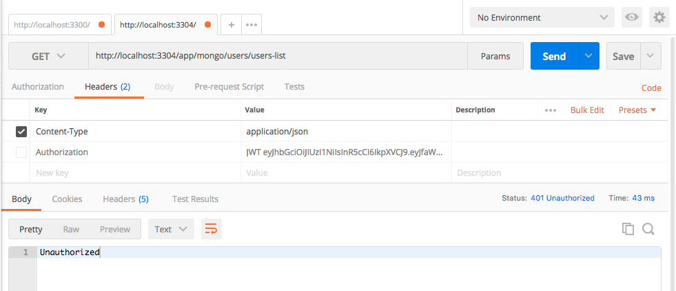
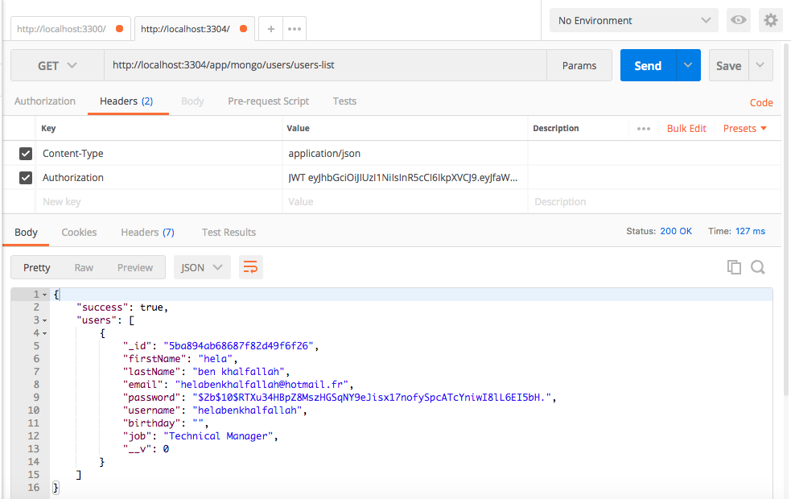

# node-express-mongoose-sqlize
node, express, mongoose, sqlize

-------- Settings ------------

1. configure lint :
yarn add eslint
./node_modules/.bin/eslint --init

2. add a /server/server.js file
we start by configure a simple express server

3. configure dotenv :
yarn add dotenv
in index.js file and before any load :

```js
//dot env configuration
var dotenv = require('dotenv')
dotenv.load()

//launch server after loading env var
require('./server/server.js')
```
4. add cors, mongoose and bluebird
yarn add cors mongoose bluebird

5. add models folder which will contains all mongoose schema.
6. all models defined on models are exported on a single module inside index.js.
7. Define all constant inside .env file.
8. add babel to run ES6
```js
yarn add babel-cli
yarn add babel-preset-es2015
yarn add babel-preset-stage-0
```
9. add  .babelrc
```js
{
  "presets": ["es2015", "stage-0"]
}
```
10. modify package.json to run with babel
11. add express 
yarn add express
12. add nodemon so that it will automatically reload the app on everychange
```js
yarn add nodemon --dev
```
https://javierfernandes.gitbooks.io/rest-api-babel-express/content/nodeapp.html

13. mongo database preparation :
https://docs.mongodb.com/manual/tutorial/install-mongodb-on-os-x/
https://stackoverflow.com/questions/2518127/how-do-i-reload-bashrc-without-logging-out-and-back-in

14. install Robomongo
15. customize logger file
```js
yarn add morgan winston winston-daily-rotate-file
```
16. Test express default route - create a route file : AppRouter.js.
17. Test express default route - modify server.js :
```js
//routes
app.use('/users', AppRouter) 
app.use('/photos', AppRouter)

//route index
app.get('/', (req, res) => {
  res.send('Invalid endpoint!')
})
```

-------- End Settings ------------

18. add body-parser :
npm install body-parser

19. install sequelize
http://docs.sequelizejs.com/manual/installation/getting-started.html

yarn add sequelize-cli sequelize
yarn add pg pg-hstore 

20. adding lodash 
yarn add lodash


21. configure sequelize

Add .sequelizerc on which you define sequelize path for configuration :
```js
var path = require('path');
module.exports = {
  'config': path.resolve('./db/psql/config', 'config.json'),
  'migrations-path': path.resolve('./db/psql', 'migrations'),
  'models-path': path.resolve('./db/psql', 'models'),
  'seeders-path': path.resolve('./db/psql', 'seeders')
}
```

Add new model :
```js
node_modules/.bin/sequelize model:create --name UserEntity --attributes "firstName: string, lastName: string, email: string,birthday: date, job: string, created_at : date, updated_at : date"
```

This will generate : 
a UserEntity file under models folder.
a migrations file under migrations folder.

run below command to create table :
```js
node_modules/.bin/sequelize db:migrate
```

22. I choose to put all db config inside .env file :
```js
// mongoose const
MONGOOSE_DB_HOST = 127.0.0.1 
MONGOOSE_DB_PORT = 27017 
MONGOOSE_DB_NAME =  local

// psql const
PSQL_DB_PORT = 5432 
PSQL_DB_HOST = 127.0.0.1 
PSQL_DB_USER =  admin
PSQL_DB_PASSWORD =  admin
PSQL_DB_DIALECT =  postgres
PSQL_DB_NAME =  appsqlizepsqldb
```

sequelize conf file is only need for migration command, be careful to update it when env confs change.
 
23. important folders :
Routes : / routes
dbs configs, connections and models : /db  

24. add jsonwebtoken
npm install jsonwebtoken --save

25. add unit test :
yarn add mocha chai sinon sinon-mongoose

26. authentication :
yarn add jsonwebtoken passport passport-local-mongoose bcrypt passport-jwt

27. Passport strategy configuration : 
/passport/passport.js
```js
let opts = {}
opts.jwtFromRequest = ExtractJWT.fromAuthHeaderWithScheme(process.env.JWT_SCHEME)
opts.secretOrKey = process.env.JWT_SECRET_OR_KEY
const passeportJWTStrategy = new JWTStrategy(opts, function (jwt_payload, done) {
  const email = jwt_payload.email
  User.findOne({ email: email }, (error, user) => {
    if (error) {
      return done(error, false)
    } else {
      if (user) {
        done(null, user)
      } else {
        done(null, false)
      }
    }
  })
})
```

28. Configure server to user passport :
```js
import passport from 'passport'

// init and configure passport
app.use(passport.initialize())
```

29. secure Routers :
```js 
MgUserRouter.get(process.env.USER_LIST_PATH,
  passport.authenticate(process.env.JWT_SCHEME, { session: false }), (request, response) => {
    const token = AuthUtils.retrieveToken(request.headers)
    if (AuthUtils.isValidToken(token)) {
      // valid token
      UserController.find(request, response)
    } else {
      // invalid token
      response
        .status(401)
        .send({
          success: false,
          message: MesssageProvider.messageByKey(Messages.KEYS.WRONG_SESSION)
        })
    }
  })
```

30. configure server auth router to use auth middleware :
```js
//app routes
// authentication routes
app.use(process.env.AUTH_BASE_PATH, AuthRouter)
```

31. Register user will only create an account.
32. Login user : will find the user and generate JWT token if success :
**AuthController**
```js
User.findOne({ email: email }, (error, user) => {
      // check if user exist 
      if (error) {
        response.status(401).send({
          success: false,
          message: error.message
        })
      } else {
        if (!user) {
          response.status(401).send({
            success: false,
            message: MesssageProvider
              .messageByKey(Messages.KEYS.USER_NOT_EXIST)
          })
        } else {
          // check if password matches 
          user.comparePassword(password, (error, isMatch) => {
            if (isMatch && !error) {

              // if user is found and password is right create a token
              //algorithm: process.env.JWT_TOKEN_HASH_ALGO 
              const token = jwt.sign(user.toJSON(), process.env.JWT_SECRET_OR_KEY, {
                expiresIn: process.env.JWT_TOKEN_EXPIRATION
              })

              // return the information including token as JSON
              response
                .status(200)
                .send({
                  success: true,
                  user: user,
                  token: `${process.env.JWT_TOKEN_PREFIX} ${token}`
                })
```

33. Results :

 

